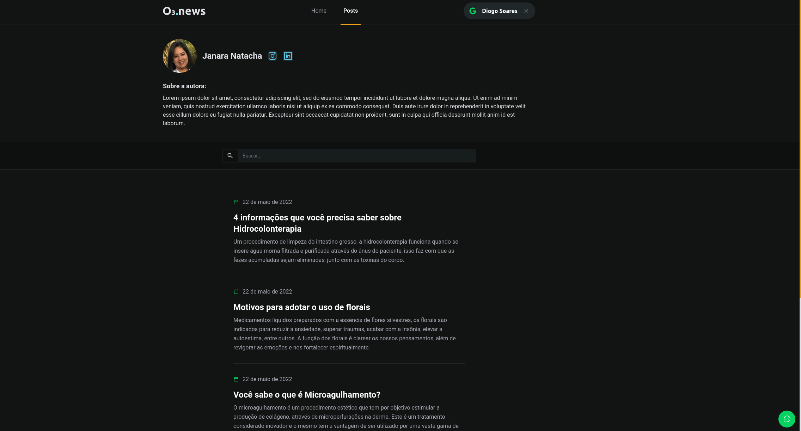

 

## 📄 Descrição

Blog desenvolvido para postagem de conteúdo sobre estética, saúde integrativa e ozonioterapia.
Feito com ReactJS, NextJS, FaunaDB, Prismic CMS, Tailwind

## 🌎 Versão Ao Vivo

## 🛠 Technologies

![react][react] ![nextjs][nextjs] ![tailwind css][tailwind] ![prismic][prismic] ![fauna db][faunadb]

## 📷 Screenshots

## 🦾 Sobre mim

[react]: https://img.shields.io/badge/react-1E4174?style=for-the-badge&logo=react&logoColor=white&labelColor=81D8F7

[prismic]: https://img.shields.io/badge/prismic-1E4174?style=for-the-badge&logo=prismic&logoColor=black&labelColor=ffffff

[faunadb]: https://img.shields.io/badge/fauna-1E4174?style=for-the-badge&logo=fauna&logoColor=4909C2&labelColor=white

[tailwind]: https://img.shields.io/badge/tailwind%20css-1E4174?style=for-the-badge&logo=tailwindcss&logoColor=white&labelColor=0EA5E9

[nextjs]: https://img.shields.io/badge/nextjs-1E4174?style=for-the-badge&logo=vercel&logoColor=white&labelColor=000000
